# Ontologies with Pain Terms
An [EBI Ontology Lookup Service search](https://www.ebi.ac.uk/ols/search?q=pain) found over 7,000 terms containing the word 'pain'. Below are brief summaries of the `pain` term/class found in the most relevant ontologies. `Pain` terms from SNOMED CT and MeSH are also included.  

With the exception of SNOMED CT and MeSH, the `owl` directory contains portions of the ontologies in which the `pain` term, the hierarchy containing `pain`, any children of `pain`, and a number of related axioms and associated terms have been extracted (using [robot](http://robot.obolibrary.org/)). In order to view the ontologies, you will need to install the [Protégé](https://protege.stanford.edu/) ontology editor. Details on how `robot` is used to extract the ontologies can be found by viewing the `*.sh` files in the `scripts` directory.

## Human Phenotype Ontology (HP)
[http://purl.obolibrary.org/obo/HP_0012531](http://purl.obolibrary.org/obo/HP_0012531)

**Definition**   
**Pain** =df An unpleasant sensory and emotional experience associated with actual or potential tissue damage, or described in terms of such damage.  

**Parent terms**   
**Constitutional symptom** =df A symptom or manifestation indicating a systemic or general effect of a disease and that may affect the general well-being or status of an individual.  
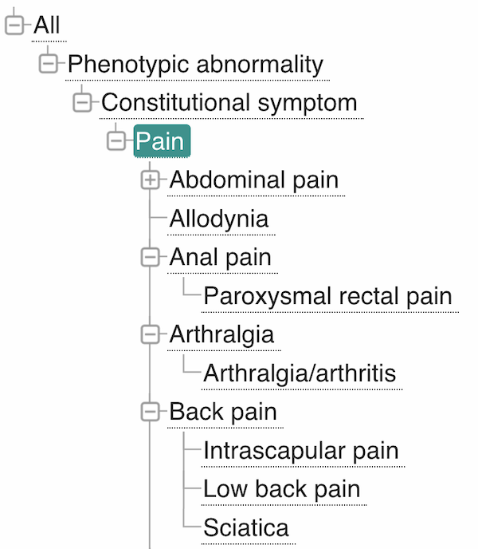

**Phenotypic abnormality** =df A phenotypic abnormality   

## NCI Thesaurus (NCIT)
[http://purl.obolibrary.org/obo/NCIT_C3303](http://purl.obolibrary.org/obo/NCIT_C3303)  
[http://purl.obolibrary.org/obo/NCIT_C143725](http://purl.obolibrary.org/obo/NCIT_C143725)  

**Definition**  
**Pain** =df The sensation of discomfort, distress, or agony, resulting from the stimulation of specialized nerve endings.  
**Pain, CTCAE** =df A disorder characterized by the sensation of marked discomfort, distress or agony. [ CTCAE 5.0 NCI ]

**Parent terms**  
**System** =df Subjective evidence of disease perceived by the patient.  

**Sign or Symptom** =df Objective evidence of disease perceptible to the examining practitioner (sign) and subjective evidence of disease perceived by the patient (symptom).  

**Finding** =df Clinical, laboratory or molecular evidence, or absence of evidence of disease.   

**Disease, Disorder or Finding** =df A condition that is relevant to human neoplasms and non-neoplastic disorders. This includes observations, test results, history and other concepts relevant to the characterization of human pathologic conditions.

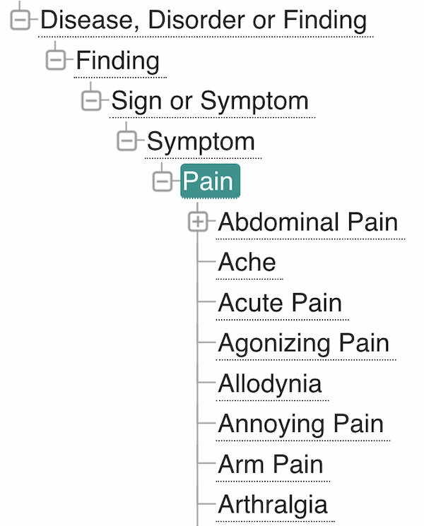

**General Disorders and Administration Site Conditions, CTCAE** (no definition)  

**CTCAE by Body System** (no definition)  

**Adverse Event** =df Any unfavorable or unintended disease, sign, or symptom (including an abnormal laboratory finding) that is temporally associated with the use of a medical treatment or procedure, and that may or may not be considered related to the medical treatment or procedure. Such events can be related to the intervention, dose, route of administration, patient, or caused by an interaction with another drug(s) or procedure(s).

**Finding by Cause** (no definition)  

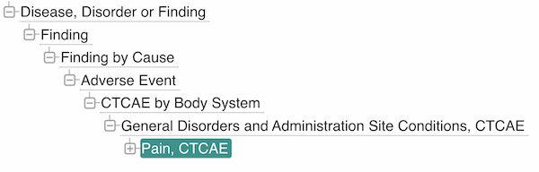

## Ontology for MIRNA Target (OMIT)
[http://purl.obolibrary.org/obo/OMIT_0011149](http://purl.obolibrary.org/obo/OMIT_0011149)

**Definition**  
None given

**Parent terms**
Pain is found in multiple hierarchies.  

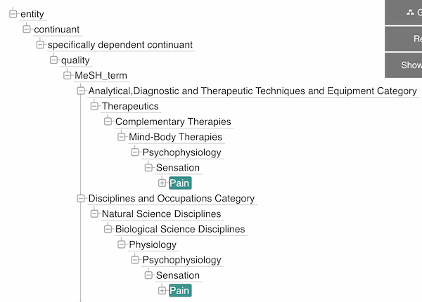  
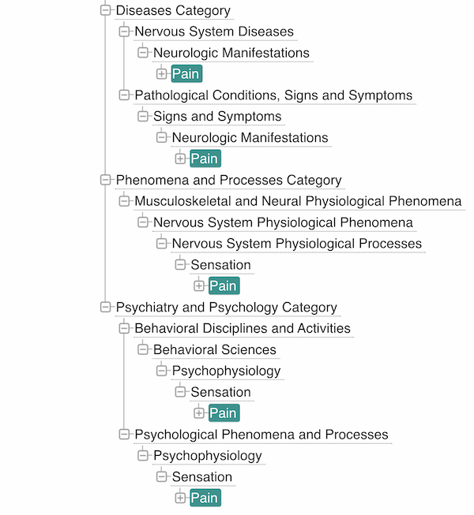

## Sickle Cell Disease Ontology (SCDO)
[http://purl.obolibrary.org/obo/SCDO_0000851](http://purl.obolibrary.org/obo/SCDO_0000851)  

**Definition**  
**Pain** =df An unpleasant sensory and emotional experience triggered in the nervous system, associated with actual or potential tissue damage, or described in terms of such damage.  

**Parent terms**  
See Human Phenotype Ontology (HP)

## Semanticscience Integrated Ontology (SIO)  
[http://semanticscience.org/resource/SIO_000951](http://semanticscience.org/resource/SIO_000951)  

**Definition**  
**pain** =df Pain is an unpleasant sensory and emotional experience associated with actual or potential tissue damage, or described in terms of such damage.   

**Parent terms**   
**hurt** =df hurt is an unpleasant feeling, emotion or sensation.  

**negative emotion** =df negative emotion is an emotion that does not feel good.

**emotion** =df An emotion is a process (experience) that arises internally or from an involuntary physiological response to a stimulus.  

**behavior** =df Behaviour is the set of actions and mannerisms made by systems (biological or otherwise) in response to stimuli or inputs, whether internal or external, conscious or subconscious, overt or covert, and voluntary or involuntary.  

**process** =df A process is an entity that is identifiable only through the unfolding of time, has temporal parts, and unless otherwise specified/predicted, cannot be identified from any instant of time in which it exists.  

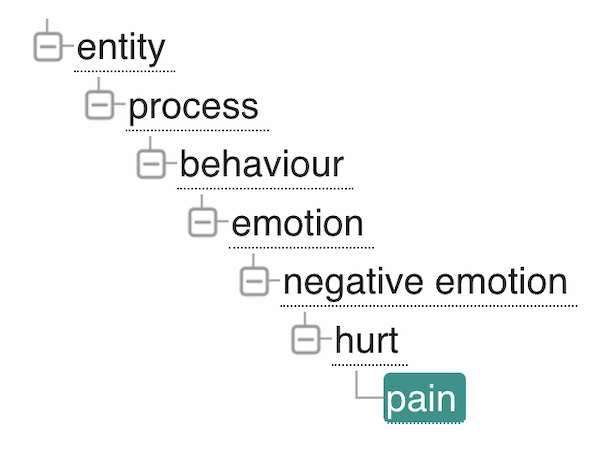

## Ontology for General Medical Science (OGMS)  
[http://purl.obolibrary.org/obo/OGMS_0000085](http://purl.obolibrary.org/obo/OGMS_0000085)  

**Definition**   
**pain** =df A bodily process in an organism S involving two integrated levels: (a) activation of the nociceptive system and associated emotion generating brain components of S, and (b) a simultaneous aversive sensory and emotional experience on the part of S, where (b) is phenomenologically similar to the sort of aversive experience involved in pain with concordant tissue damage.  

**Parent terms**   
**symptom** =df A process experienced by the patient, which can only be experienced by the patient, that is hypothesized to be clinically relevant.  

**process** = p is an occurrent that has temporal proper parts and for some time t, p s-depends_on some material entity at t.

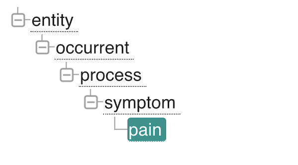

## Emotion Ontology (MFOEM)
[http://purl.obolibrary.org/obo/MFOEM_000203](http://purl.obolibrary.org/obo/MFOEM_000203)  

**Definition**  
None given

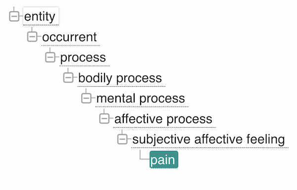

## Symptom Ontology (SYMP)  
[http://purl.obolibrary.org/obo/SYMP_0000099](http://purl.obolibrary.org/obo/SYMP_0000099)

**Definition** 
**pain** =df A sensation perception where there is an unpleasant sensation that usually indicates the body is threatened or damaged. The sensation may be sharp or dull, short-lived or chronic, intermittent or continual, confined to one area or spread over the entire body.   

**Parent terms**  
**sensation perception** =df Sensation perception is a nervous system symptom where the information perceived by sensory receptors are interpreted.   

**nervous system symptom** (no definition)  

**symptom** =df A symptom is a perceived change in function, sensation, loss, disturbance or appearance reported by a patient indicative of a disease.  

## Experimental Factor Ontology  
[http://www.ebi.ac.uk/efo/EFO_0003843](http://www.ebi.ac.uk/efo/EFO_0003843)  

**Definition**   
**pain** =df An unpleasant sensation induced by noxious stimuli which are detected by NERVE ENDINGS of NOCICEPTIVE NEURONS.  

**Parent terms**  
**sign or symptom** =df Objective evidence of disease perceptible to the examining physician (sign) and subjective evidence of disease perceived by the patient (symptom).  
Clinical manifestations that can be either objective when observed by a physician, or subjective when perceived by the patient.  

**phenotype** =df The observable form taken by some character (or group of characters) in an individual or an organism, excluding pathology and disease. The detectable outward manifestations of a specific genotype.  

**quality** =df A quality is an entity that describes some aspect which is intrinsic to that particular object and is dependent on or more material entities in which it inheres in or is borne by.  

**material property** =df An experimental factor which is a property or characteristic of some other entity. For example, the mouse has the colour white.  

**experimental factor** =df An experimental factor in Array Express which are essentially the variable aspects of an experiment design which can be used to describe an experiment, or set of experiments, in an increasingly detailed manner. This upper level class is really used to give a root class from which applications can rely on and not be tied to upper ontology classses which do change.   

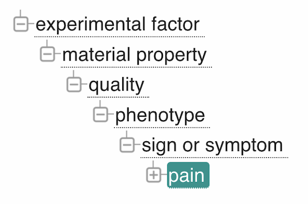  

## Gene Ontology (GO)  
[http://purl.obolibrary.org/obo/GO_0048265](http://purl.obolibrary.org/obo/GO_0048265)  

**Definition**  
**response to pain** =df Any process that results in a change in state or activity of a cell or an organism (in terms of movement, secretion, enzyme production, gene expression, etc.) as a result of a pain stimulus. Pain stimuli cause activation of nociceptors, peripheral receptors for pain, include receptors which are sensitive to painful mechanical stimuli, extreme heat or cold, and chemical stimuli.  

**Parent terms**   
**multicellular organismal response to stress** =df Any process that results in a change in state or activity of a multicellular organism (in terms of movement, secretion, enzyme production, gene expression, etc.) as a result of a stimulus indicating the organism is under stress. The stress is usually, but not necessarily, exogenous (e.g. temperature, humidity, ionizing radiation).  

**response to stress** =df Any process that results in a change in state or activity of a cell or an organism (in terms of movement, secretion, enzyme production, gene expression, etc.) as a result of a disturbance in organismal or cellular homeostasis, usually, but not necessarily, exogenous (e.g. temperature, humidity, ionizing radiation).   

**response to stimulus** =df Any process that results in a change in state or activity of a cell or an organism (in terms of movement, secretion, enzyme production, gene expression, etc.) as a result of a stimulus. The process begins with detection of the stimulus and ends with a change in state or activity or the cell or organism.  

**biological_process** =df A biological process represents a specific objective that the organism is genetically programmed to achieve. Biological processes are often described by their outcome or ending state, e.g., the biological process of cell division results in the creation of two daughter cells (a divided cell) from a single parent cell. A biological process is accomplished by a particular set of molecular functions carried out by specific gene products (or macromolecular complexes), often in a highly regulated manner and in a particular temporal sequence.  

**multicellular organismal process** =df Any biological process, occurring at the level of a multicellular organism, pertinent to its function.  

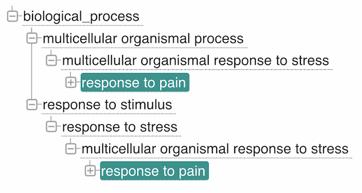  

## SNOMED CT 
website: [https://browser.ihtsdotools.org/](https://browser.ihtsdotools.org/)
SCTID: 22253000 Pain (finding)

**Definition** 
None given. See diagram.

**Parent terms**  
**Pain / sensation finding (finding)**  
**Sensory nervous system finding (finding)**    
**Neurological finding (finding)**  

**Note**: [Clinical finding](https://confluence.ihtsdotools.org/display/DOCSTART/6.+SNOMED+CT+Concept+Model) defined as:
represents the result of a clinical observation, assessment or judgment and includes normal and abnormal clinical states (e.g. asthma, headache, normal breath sounds). The clinical finding hierarchy includes concepts used to represent diagnoses.

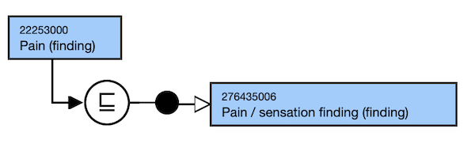  
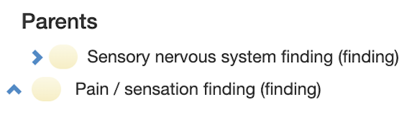  
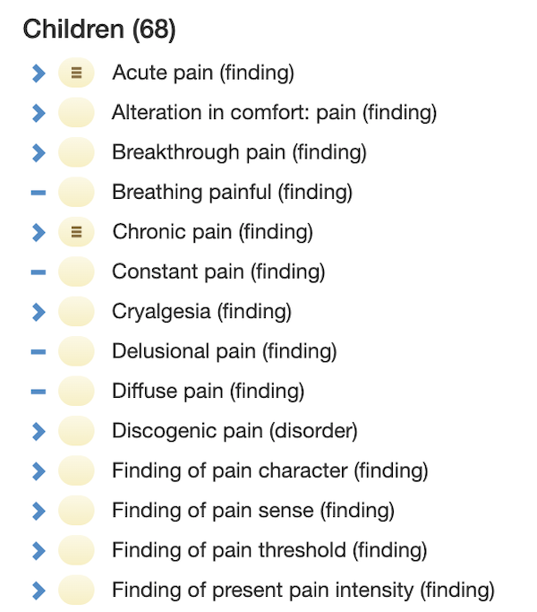  

## Medical Subject Headings (MeSH)
website: [https://www.ncbi.nlm.nih.gov/mesh/](https://www.ncbi.nlm.nih.gov/mesh/)
https://www.ncbi.nlm.nih.gov/mesh/68010146

**Definition**  
**Pain** =df An unpleasant sensation induced by noxious stimuli which are detected by NERVE ENDINGS of NOCICEPTIVE NEURONS.

**Parent terms**
**Neurologic Manifestations** =df Clinical signs and symptoms caused by nervous system injury or dysfunction.  

**Signs and Symptoms** =df Clinical manifestations that can be either objective when observed by a physician, or subjective when perceived by the patient.  

**Pathological Conditions, Signs and Symptoms** =df Abnormal anatomical or physiological conditions and objective or subjective manifestations of disease, not classified as disease or syndrome.  

**Diseases Category** (no definition)

